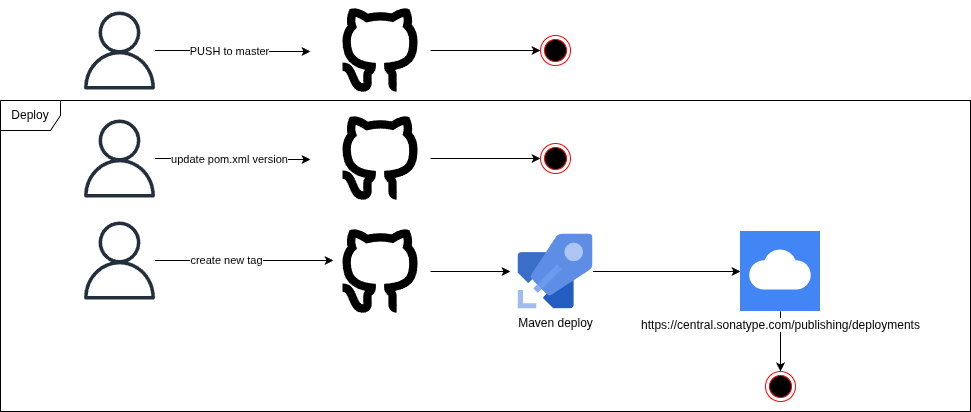

# ASAAS SDK

This SDK was built by @jpdev01 to facilitate the development of integrations with [Asaas](https://asaas.com.br)

## 1. User Guide
Setup and usage is described in our [User Guide](https://jpdev01.github.io/asaasSdk/)

## 2. Installation
The recommended way to use the AWS SDK for Java in your project is to consume it from Maven Central. (includes all modules present in the API).

```xml
<dependency>
    <groupId>io.github.jpdev01</groupId>
    <artifactId>asaassdk</artifactId>
    <version>1.4</version>
</dependency>
```

## 3. SonarQube

The project is continuously analyzed by SonarQube and the report can be found [here](https://sonarcloud.io/summary/overall?id=jpdev01_asaasSdk)

## 4. Asaas Documentation

The API official documentation can be found [here](https://docs.asaas.com/docs/visao-geral)

## 5. Deploy


Check out the available versions on [Maven Repository](https://repo1.maven.org/maven2/io/github/jpdev01/asaassdk/)
